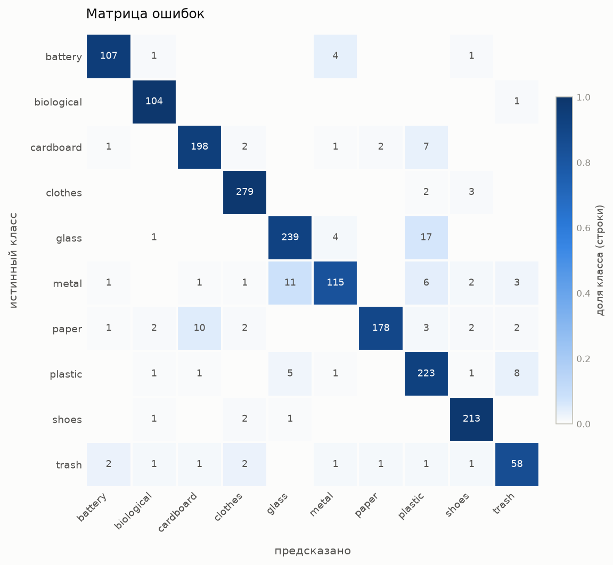
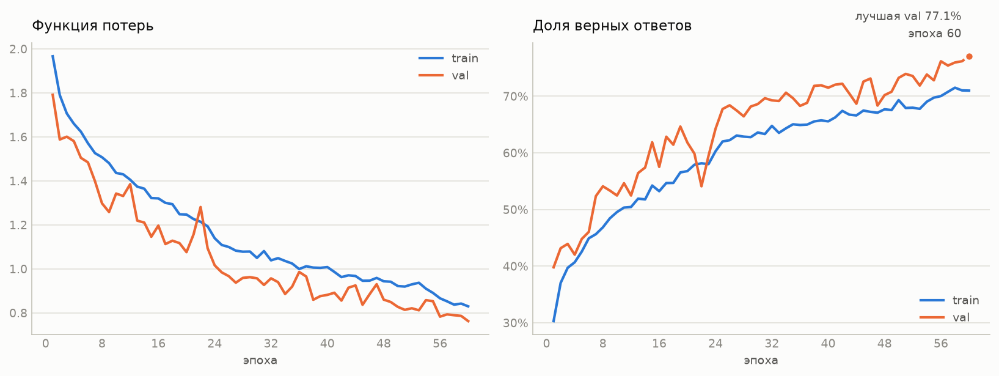

# Классификация мусора по фотографии (PyTorch)

**Живое демо: https://huggingface.co/spaces/gapkold/trash-classification** —
работает целиком в браузере, без сервера.


Модель относит изображение к одному из 10 типов отходов. Два подхода к одной
задаче — свёрточная сеть, обученная с нуля, и transfer learning на ResNet18, —
собраны в одном пайплайне и сравниваются на общей отложенной выборке.

**Результат: 93.2% accuracy на тесте** (дообученный ResNet18) против 76.6% у
сети, обученной с нуля.

## Проблема

Раздельный сбор упирается в сортировку: человек у контейнера должен за секунду
решить, куда отправить предмет, и ошибается тем чаще, чем больше категорий.
Задача — по одной фотографии предсказать тип отхода.

Что считается успехом:

- **основная метрика — balanced accuracy**, а не обычная accuracy. Классы
  несбалансированы в 4.2 раза, и модель, игнорирующая редкие категории, может
  показать приличную accuracy, оставаясь бесполезной именно там, где ошибка
  дороже (батарейка в общем баке — это не то же самое, что картон в бумаге);
- инференс должен укладываться в доли секунды на обычном железе.

## Датасет

[Garbage Classification](https://www.kaggle.com/datasets/mostafaabla/garbage-classification)
(Kaggle), 12 259 изображений, 10 классов.

| класс | всего | train | val | test |
|---|---|---|---|---|
| battery | 756 | 529 | 114 | 113 |
| biological | 699 | 489 | 105 | 105 |
| cardboard | 1411 | 988 | 212 | 211 |
| clothes | 1892 | 1325 | 283 | 284 |
| glass | 1736 | 1215 | 260 | 261 |
| metal | 930 | 651 | 139 | 140 |
| paper | 1336 | 935 | 201 | 200 |
| plastic | 1597 | 1118 | 239 | 240 |
| shoes | 1449 | 1014 | 218 | 217 |
| trash | 453 | 317 | 68 | 68 |
| **итого** | **12 259** | **8581** | **1839** | **1839** |

Разбиение 70/15/15 **стратифицированное**. При случайном сплите доля самого
редкого класса (`trash`, 453 файла) гуляет настолько, что per-class recall
становится несопоставим между запусками.

### Важно: серый паддинг в «стандартизированных» вариантах

Датасет содержит три варианта одних и тех же изображений: `original`,
`standardized_256` и `standardized_384`. Оба стандартизированных приведены к
квадрату **дополнением серым полем** (RGB 114,114,114). Замер по 60 файлов на
класс:

| вариант | файлов с полями | среднее поле | максимум |
|---|---|---|---|
| `original` | 0% | 0% | 0% |
| `standardized_256` | 77% | 21% кадра | 76% |
| `standardized_384` | 79% | 22% кадра | 73% |

Доля файлов с полями заметно зависит от класса — 43% у `battery` против 95% у
`biological`. То есть **количество серого коррелирует с меткой**, и сеть может
читать его вместо самого объекта: утечка препроцессинга в целевую переменную.

Поэтому проект работает с `original`, а приведение к нужному размеру делают
трансформы: `Resize(256)` по короткой стороне (пропорции сохраняются) +
кадрирование до 224. Вариант `Resize((256, 256))` сплющил бы вытянутые кадры —
бутылка, сжатая по вертикали, начинает выглядеть как банка.

Цена перехода на `original`, замеренная на 800 файлах: медианное соотношение
сторон 1.33 (p95 = 1.85), центральный кроп сохраняет ~57% площади исходника.
У 33% файлов короткая сторона меньше 224 px, то есть они апскейлятся — в
стандартизированных вариантах это уже произошло, просто молча.

## Подход

### Аугментации

Принцип: аугментация имитирует вариативность, которая в реальных фото есть, но
**не является признаком класса**. Всё, что реально различает классы, трогать нельзя.

| приём | зачем |
|---|---|
| `RandomHorizontalFlip` | у бутылки нет канонической левой стороны; отражение — валидное изображение того же класса |
| `RandomRotation(±15°)` | снимки сделаны с рук, наклон камеры случайный |
| `ColorJitter` | освещение гуляет (кухня, улица, вспышка) |
| `RandomCrop(224)` из 256 | объект оказывается в разных местах кадра |

Тонкости, которые важнее самого списка:

- **`hue` ограничен 0.03** при `brightness/contrast/saturation = 0.25`. Для
  мусора цвет — настоящий разделяющий признак: коричневый картон против белой
  бумаги, зелёное стекло. Крутить оттенок широко значит превращать картон в
  бумагу прямо в обучающей выборке;
- **углы после поворота заливаются ImageNet-средним**, а не чёрным. После
  нормализации такая заливка даёт ≈0 — нейтральный пиксель. Чёрные углы сеть
  быстро выучивает как метку «здесь была аугментация»;
- **вертикального флипа нет намеренно**: на упаковке есть текст и логотипы, а
  перевёрнутый текст в реальных данных не встречается.

Нормализация — ImageNet mean/std. Для transfer это обязательно (предобученные
слои калиброваны под это распределение), для сети с нуля — безвредное
фиксированное преобразование.

### Архитектура 1: своя CNN

4 свёрточных блока `Conv3x3 → BN → ReLU → MaxPool`, каналы 32→64→128→256, затем
Global Average Pooling и `Linear(256 → 10)`. **391 466 параметров.**

Почему именно так:

- **число блоков задано с двух сторон.** Сверху — размером выборки: ~8.6k
  обучающих изображений при 391k параметров это уже ~45 параметров на картинку;
  при 8 блоках счёт ушёл бы за 5M и сеть выучила бы выборку наизусть. Снизу —
  рецептивным полем: после 3 блоков оно 22 px (масштаб отдельного края), после
  4 — 46 px (масштаб фактуры: складка бумаги, блик на стекле);
- **MaxPool внутри блоков, GAP в голове.** Максимум отвечает на вопрос «признак
  есть где-то поблизости?», игнорируя точную позицию — то, что нужно детекторам
  краёв. В голове наоборот нужно среднее: доля кадра с данной фактурой —
  осмысленный признак класса;
- **GAP вместо Flatten экономит 25.7M параметров.** Классический
  `Flatten + Linear(256·14·14 → 512)` стоил бы 25 690 624 параметра — в 65 раз
  больше всей остальной сети, и именно там такие модели переобучаются;
- **BatchNorm** позволяет держать LR на порядок выше и не подбирать
  инициализацию идеально; `bias=False` у свёрток, потому что у BN есть свой сдвиг;
- **Kaiming He init**: ReLU обнуляет половину значений, без поправки дисперсия
  активаций затухает вглубь.

### Архитектура 2: transfer learning на ResNet18

Свёрточная часть с весами ImageNet-1k замораживается, выход 512 признаков идёт
в новый `Linear(512 → 10)`. Обучается **5 130 параметров из 11 181 642** (0.05%).

Ключевая тонкость реализации: `requires_grad = False` останавливает градиенты,
но **не** running-статистики BatchNorm — в train-режиме они продолжают
пересчитываться под наш датасет, и «замороженный» backbone медленно уплывает без
единого шага оптимизатора. Отладить это тяжело: ошибок нет, просто метрика хуже,
чем должна быть. Поэтому `TransferResNet18` переопределяет `.train()` и держит
BN в `eval`, когда backbone заморожен.

### Обучение

AdamW (lr 1e-3, weight decay 1e-4), `ReduceLROnPlateau` **по val accuracy** — раз
модель отбирается по этой метрике, по ней же логично резать LR. Веса классов
обратны частоте (`--class-weights`).

## Результаты

Тестовая выборка — 1839 изображений, ни разу не участвовавших в обучении.

| прогон | обучаемых параметров | эпох | test accuracy | balanced accuracy | macro F1 |
|---|---|---|---|---|---|
| **`resnet18_finetune`** — ResNet18, backbone разморожен | 11 181 642 | 15 | **0.932** | **0.925** | **0.924** |
| `resnet18_transfer` — ResNet18, backbone заморожен | 5 130 | 10 | 0.873 | 0.872 | 0.862 |
| `simple_cnn_60ep` — своя CNN | 391 466 | 60 | 0.766 | 0.760 | 0.762 |
| `simple_cnn` — своя CNN | 391 466 | 25 | 0.694 | 0.689 | 0.689 |

Три вывода из таблицы:

1. **Предобученные веса решают.** Даже линейный пробинг — 5 130 обучаемых
   параметров против 391 466 — обгоняет сеть с нуля на 18 п.п., обучаясь вдвое
   меньше эпох. Ни при каком бюджете эпох своя CNN этот разрыв не закрыла.
2. **Разморозка backbone даёт ещё +5.9 п.п.** (0.873 → 0.932). Замороженные
   ImageNet-признаки хороши, но не заточены под материалы; дообучение на lr 1e-4
   адаптирует их, не разрушая.
3. **Своей CNN не хватало эпох, а не архитектуры**: +7.2 п.п. от простого
   продления с 25 до 60 эпох. При этом и на 60-й эпохе она показала свой лучший
   результат — то есть **не сошлась и там**.

Близость accuracy и balanced accuracy во всех прогонах (0.932 против 0.925 у
лучшего) означает, что взвешивание классов сработало: модель не выехала за счёт
крупных классов.

### По классам

| класс | F1, finetune | F1, замороженный | F1, своя CNN (60 эпох) |
|---|---|---|---|
| clothes | 0.976 | 0.975 | 0.836 |
| shoes | 0.968 | 0.964 | 0.744 |
| biological | 0.963 | 0.957 | 0.883 |
| battery | 0.951 | 0.911 | 0.767 |
| cardboard | 0.938 | 0.891 | 0.791 |
| paper | 0.934 | 0.825 | 0.743 |
| glass | 0.925 | 0.847 | 0.791 |
| plastic | 0.894 | 0.771 | 0.693 |
| metal | 0.865 | 0.785 | 0.683 |
| trash | 0.829 | 0.693 | 0.686 |

Порядок классов по сложности у всех трёх моделей одинаков — значит трудность
задаётся самими данными, а не архитектурой. Больше всего от дообучения выиграли
`trash` (+0.136), `plastic` (+0.123) и `paper` (+0.109): именно те классы, где
нужны материаловедческие признаки, которых в ImageNet-предобучении нет.



### Разбор ошибок

**Лучшие классы — `clothes` и `shoes`** (F1 0.976 и 0.968). Прямое следствие
того, что в ImageNet-1k есть `jersey`, `running shoe` и подобные категории:
предобученные признаки заточены ровно под них. Показательно, что дообучение их
почти не улучшило (+0.001 и +0.004) — там и так был потолок.

**Худший класс — `trash`** (F1 0.829). Класс-помойка без аналога в ImageNet,
определяемый через «ничего из остального». Именно он больше всех выиграл от
дообучения (+0.136): признаки для него приходится выучивать с нуля, а
замороженный backbone этого не умеет по определению.

**Основная масса оставшихся ошибок — кластер блестящих ёмкостей.** У замороженной
модели `plastic` → `glass` 33 случая, `glass` → `plastic` 16, `plastic` → `metal`
14. Различает их не форма и не текстура, а тонкие свойства материала —
прозрачность, характер бликов. Дообучение сократило этот кластер, но не убрало:
`metal` остаётся слабейшим по recall (0.821).

Отдельно стоит отметить, что **своя CNN не сошлась даже за 60 эпох**: свой
лучший результат она показала на самой последней эпохе, кривые потерь всё ещё
падают, а расхождения train/val нет вовсе — переобучение не началось. Это ответ
на вопрос «мало эпох или мала модель»: пока мало эпох.



### Производительность

Обучение на RTX 3070 (i7-8700K, 6 ядер / 12 потоков): **18 секунд на эпоху**,
первая эпоха 139 секунд.

Узким местом оказалась не арифметика, а загрузка данных. С четырьмя воркерами
эпоха занимала 90 секунд — столько же, сколько на CPU при вчетверо меньшей
стороне кадра: видеокарта простаивала, ожидая распаковки 8581 JPEG. Вдобавок на
Windows воркеры порождаются через spawn и **пересоздавались каждую эпоху**,
заново импортируя CUDA-сборку torch. `persistent_workers=True`, увеличенный
`prefetch_factor` и подбор числа воркеров от числа потоков дали ускорение в
5.3 раза; дорогая первая эпоха — это разовый старт воркеров.

## Демо

Интерфейс показывает вероятности классов и подсказку, что делать с предметом.

Локальный запуск (модель выбирается автоматически — лучшая по val accuracy среди
всех прогонов):

```bash
pip install -r requirements.txt
python app/app.py
```

Открывается на http://localhost:7860. Можно загрузить своё изображение или
кликнуть пример из датасета — по одному на каждый класс.

Предобработка в демо берётся из `src.dataset.get_eval_transforms()`, а не
пишется заново: любое расхождение с валидацией (другой ресайз, забытая
нормализация) дало бы молчаливую деградацию — модель работает, но хуже, и понять
это по интерфейсу невозможно.

### Публикация: инференс в браузере

Развёрнутое демо — **статический** Space: HTML, JS и файл модели, без Python на
сервере. Так вышло не от хорошей жизни: Hugging Face теперь требует PRO-подписку
для Gradio- и Docker-Spaces даже на бесплатном железе (`402 Payment Required` при
попытке создать). Бесплатными остались только статические.

Ограничение обернулось плюсом. Модель уезжает в ONNX и считается через
`onnxruntime-web` **на устройстве посетителя**: нет холодного старта, нет лимитов
по запросам, фотографии никуда не отправляются.

```bash
python export_onnx.py          # ONNX + квантизация + сверка точности
python build_static_space.py   # собирает deploy_static/ (11.5 МБ)
```

Замеры экспорта на тестовой выборке:

| модель | размер | accuracy | совпадений с PyTorch |
|---|---|---|---|
| PyTorch | 134 МБ | 0.9325 | — |
| ONNX fp32 | 44.7 МБ | 0.9325 | 100% (max \|Δ\| логита = 0.0000) |
| **ONNX int8** | **11.2 МБ** | 0.9200 | 96.75% |

Развёрнут int8: страницу открывают с телефона, и вчетверо меньший трафик важнее
одного процентного пункта. Флаг `--precision fp32` собирает вариант без потерь.

**Предобработка на JS повторяет `get_eval_transforms()`** — `Resize(256)` по
короткой стороне, `CenterCrop(224)`, нормализация под ImageNet. Сверено на живых
данных: максимальное расхождение логитов между браузером и Python — **0.085** при
величине логитов около 9 (разница ресемплинга canvas и PIL), предсказания
идентичны. В браузере 10/10 на примерах, ~114 мс на изображение.

Вариант с Gradio-Space собирается `python build_space.py` в папку `deploy/` — он
готов и проверен, но требует платного тарифа.

Чекпоинт выгружается через `export_for_inference()` — **134 МБ → 45 МБ**. Разница
это состояние оптимизатора AdamW: он хранит по два момента на параметр, что при
полном fine-tuning вдвое тяжелее самих весов. Для продолжения обучения нужно, для
инференса — мёртвый груз.

Код в `deploy/` не переписывается, а копируется: отдельная «версия для деплоя»
неизбежно разъехалась бы с оригиналом. Одно и то же `app.py` работает в обоих
местах — на Space оно находит `model.pt` и `examples/` рядом с собой, локально
берёт лучший чекпоинт из `checkpoints/` и картинки из датасета.

## Структура проекта

```
image-classification/
├── data/
│   └── garbage_classification/     # датасет (в git не попадает)
├── notebooks/
│   └── 01_eda.ipynb                # разведочный анализ
├── src/
│   ├── dataset.py                  # ImageFolder, трансформы, стратифицированный сплит
│   ├── model.py                    # SimpleCNN и TransferResNet18, чекпоинты
│   ├── train.py                    # цикл обучения, learning curves
│   └── evaluate.py                 # метрики, матрица ошибок, разбор ошибок
├── app/
│   └── app.py                      # Gradio-демо
├── checkpoints/<прогон>/best.pt    # веса
├── reports/<прогон>/               # метрики и графики
├── static/index.html               # исходник страницы для браузерного инференса
├── onnx/                           # экспортированная модель (генерируется)
├── deploy_static/                  # пакет статического Space (генерируется)
├── deploy/                         # пакет Gradio-Space (генерируется)
├── export_onnx.py                  # экспорт в ONNX + квантизация + сверка
├── build_static_space.py           # сборка deploy_static/
├── build_space.py                  # сборка deploy/
├── requirements.txt
└── README.md
```

## Запуск

```bash
pip install -r requirements.txt
```

Внимание: на Windows `pip install torch` ставит сборку **без** CUDA. Подробности
и правильная команда — в комментариях `requirements.txt`.

Обучение (результаты раскладываются по `checkpoints/<прогон>/` и
`reports/<прогон>/`, поэтому прогоны не затирают друг друга):

```bash
python -m src.train --arch resnet18_transfer --epochs 15 --unfreeze --lr 1e-4 --class-weights --run-name resnet18_finetune
python -m src.train --epochs 60 --class-weights --run-name simple_cnn_60ep
```

`--unfreeze` требует пониженного `--lr`: на 1e-3 предобученные веса разрушаются
на первых же шагах.

Оценка:

```bash
python -m src.evaluate --checkpoint checkpoints/resnet18_finetune/best.pt --split test
```

Полезные флаги: `--run-name` (имя прогона), `--arch` (выбор архитектуры),
`--num-workers 0` (если на Windows падает spawn).
